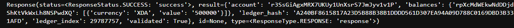

# XRPL Token Creation

This project is entails the creation of both hot & cold wallets to ensure best practice for launching a fundgable token/trustline on the XRPL. The cold wallet is the initial issuer of the token, the hot wallet is used as a user facing so one can transact publicly.

## Step-by-Step Creation

* Get Credentials
*Connect to the XRPL Testnet
* Configure Issuer Settings
* Make Hot Wallet Address
* Create Trust Line from Hot to Cold Address

