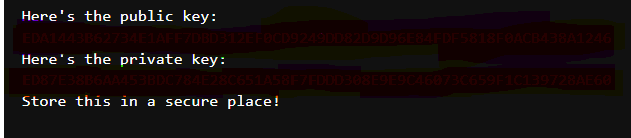

## Information

This folder walks you through the basic steps of building an easy XRP Ledger-connected application using xrpl-py , a pure Python  library that makes it easy to interact with the XRP Ledger using native Python models and methods.

-----------------

## Updates & Debugging

In order to interact with the XRP Ledger I had to import `import nest_asyncio`, this allowed me to interact with the XRP Ledger and be able to build out a wallet.

----------------

## Wallet Creation

Next I create a wallet using the testnet faucet to be ready to fund the wallet to be able to send and recieve transactions.

## Key Pairs
After connecting to the XRPL I then used the xrpl.core.keypairs module to generate seeds and derive keypairs and addresses from those seed values

----------------
