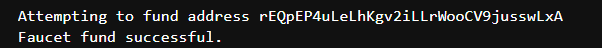
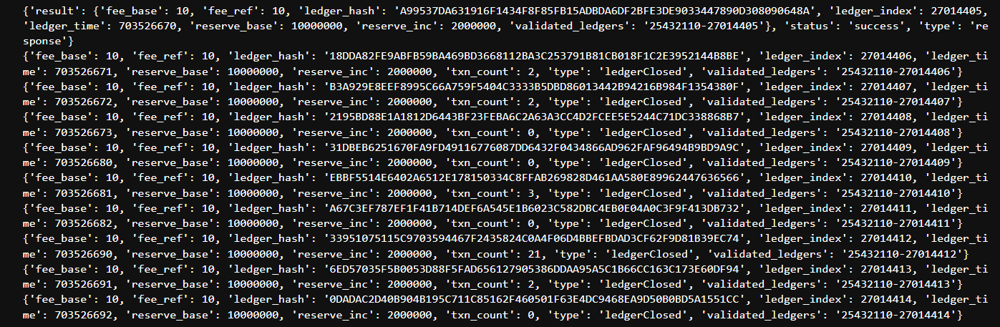
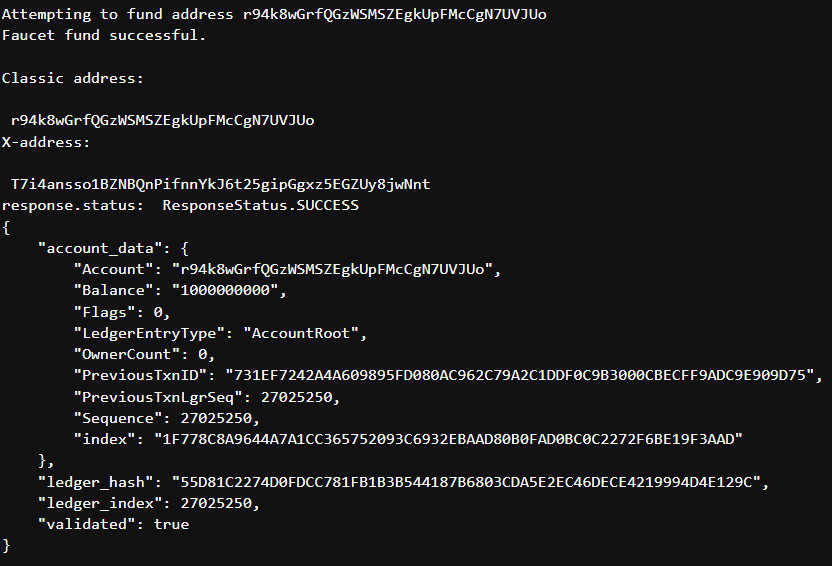

## Information

This folder walks you through the basic steps of building an easy XRP Ledger-connected application using xrpl-py , a Python library that makes it easy to interact with the XRP Ledger using native Python models and methods. In this folder are:

* The basic building blocks of XRP Ledger-based applications.
* How to connect to the XRP Ledger using xrpl-py.
* How to generate a wallet on the Testnet using xrpl-py.
* How to use the xrpl-py library to look up information about an account on the XRP Ledger.
* How to put these steps together to create a simple Python app.

-----------------

## Updates & Debugging

In order to interact with the XRP Ledger I had to import `import nest_asyncio`, this allowed me to interact with the XRP Ledger and be able to build out a wallet to interact with the XRPL.

## Testnet Ledger Connection

In order to properly run the XRP application, I had to connect to the proper [testnet servers](https://xrpl.org/xrp-testnet-faucet.html) which has WebSocket & JSON server connections. This connection allowed me to launch my application with the proper connection.

----------------

## Wallet Creation & Key Pairs

After connecting to the XRPL I then used the `xrpl.core.keypairs` module to generate seeds and derive keypairs and addresses from those seed values

## Funding Account

Next I create a wallet using the testnet faucet to be ready to fund the wallet to be able to send and recieve transactions.

-----------------

## Query the XRPL

I queried details about the generated account from the XRP Ledger, but you can use the values in the wallet instance to prepare, sign, and submit transactions with xrpl-py. You can query the XRP Ledger to get information about a specific account, a specific transaction, the state of a current or a historical ledger, and the XRP Ledger's decentralized exchange. You have to make these queries, among other reasons, to look up account info to follow best practices for reliable transaction submission.

-----------------

## Combination

Using these building blocks, I was able to create a simple Python app that:

* Generates a wallet on the Testnet.
* Connects to the XRP Ledger.
* Looks up and prints information about the account I created.

